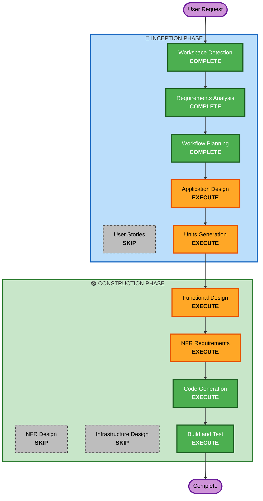

# Execution Plan

**생성일**: 2026-02-25  
**프로젝트**: 테이블오더 서비스

---

## 1. 분석 요약

### 프로젝트 유형
- **Type**: Greenfield (신규 프로젝트)
- **복잡도**: Moderate (중간)
- **위험도**: Low (낮음)

### 변경 영향 평가
| 영역 | 해당 여부 | 설명 |
|-----|---------|------|
| User-facing changes | ✅ Yes | 고객용/관리자용 웹 UI |
| Structural changes | ✅ Yes | 새로운 시스템 아키텍처 |
| Data model changes | ✅ Yes | 메뉴, 주문, 테이블 엔티티 |
| API changes | ✅ Yes | REST API + SSE 엔드포인트 |
| NFR impact | ✅ Yes | 실시간성, 보안, 성능 |

---

## 2. Workflow Visualization

---

## 3. 실행 단계 상세

### 🔵 INCEPTION PHASE

| 단계 | 상태 | 근거 |
|-----|------|------|
| Workspace Detection | ✅ COMPLETE | 완료됨 |
| Reverse Engineering | ⏭️ SKIP | Greenfield 프로젝트 |
| Requirements Analysis | ✅ COMPLETE | 완료됨 (승인됨) |
| User Stories | ⏭️ SKIP | PRD에 기능 명세 충분, 단일 개발자 |
| Workflow Planning | ✅ COMPLETE | 현재 단계 |
| Application Design | 🔶 EXECUTE | 새로운 컴포넌트/서비스 설계 필요 |
| Units Generation | 🔶 EXECUTE | Frontend/Backend 분리 작업 단위 필요 |

### 🟢 CONSTRUCTION PHASE

| 단계 | 상태 | 근거 |
|-----|------|------|
| Functional Design | 🔶 EXECUTE | 데이터 모델, API 스펙, 비즈니스 로직 설계 필요 |
| NFR Requirements | 🔶 EXECUTE | 기술 스택 확정, 성능/보안 요구사항 상세화 |
| NFR Design | ⏭️ SKIP | 로컬 개발 환경, 복잡한 NFR 패턴 불필요 |
| Infrastructure Design | ⏭️ SKIP | Docker Compose 로컬 환경, 클라우드 인프라 없음 |
| Code Generation | 🔶 EXECUTE | 실제 코드 구현 (항상 실행) |
| Build and Test | 🔶 EXECUTE | 빌드 및 테스트 (항상 실행) |

### 🟡 OPERATIONS PHASE

| 단계 | 상태 | 근거 |
|-----|------|------|
| Operations | ⏸️ PLACEHOLDER | 향후 확장 예정 |

---

## 4. 작업 단위 (Units) 예상

| Unit | 범위 | 의존성 |
|------|------|--------|
| **Unit 1: Backend API** | Express 서버, REST API, SSE, 인증 | 없음 |
| **Unit 2: Frontend - Customer** | 고객용 Next.js 앱 | Unit 1 |
| **Unit 3: Frontend - Admin** | 관리자용 Next.js 앱 | Unit 1 |
| **Unit 4: Shared** | 공유 타입, 유틸리티 | 없음 |

---

## 5. 예상 일정

| 단계 | 예상 소요 |
|-----|---------|
| Application Design | 1 세션 |
| Units Generation | 1 세션 |
| Functional Design (per unit) | 1-2 세션 |
| NFR Requirements | 1 세션 |
| Code Generation (per unit) | 2-3 세션 |
| Build and Test | 1 세션 |
| **총 예상** | **8-12 세션** |

---

## 6. 성공 기준

- [ ] 고객이 메뉴 조회 및 주문 가능
- [ ] 관리자가 실시간 주문 모니터링 가능
- [ ] 주문 상태 변경 (주문접수/조리중/완료) 동작
- [ ] 지연 주문 (30분 경과) 시각적 강조
- [ ] Docker Compose로 로컬 실행 가능
- [ ] 단위/통합/E2E 테스트 통과
